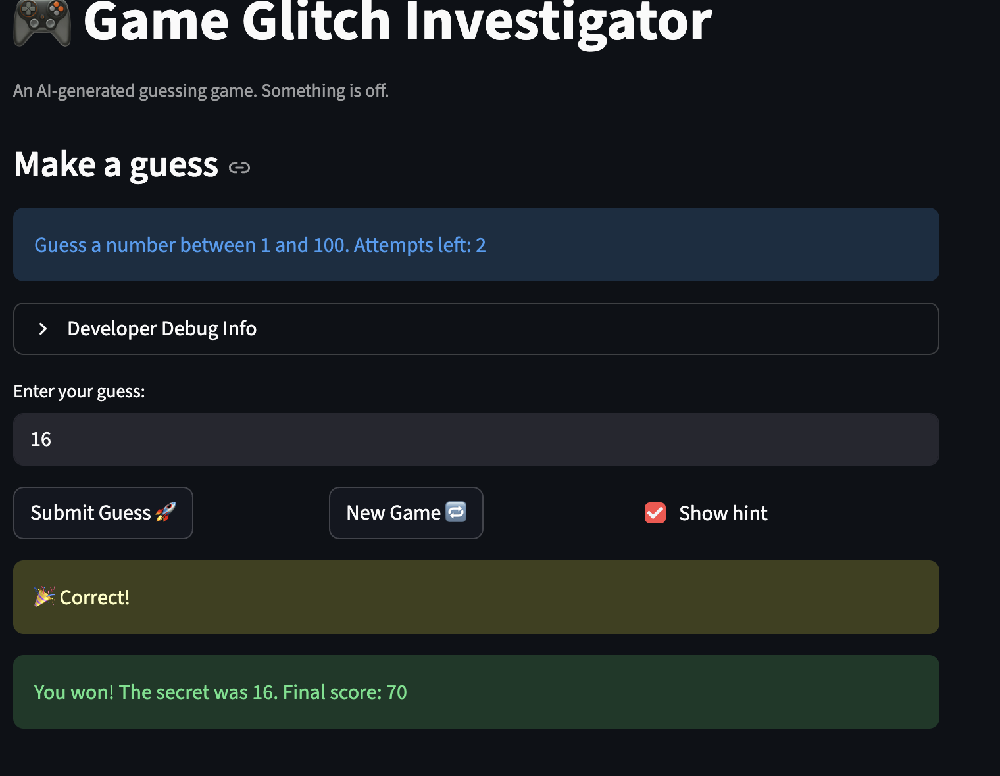

# 🎮 Game Glitch Investigator: The Impossible Guesser

## 🚨 The Situation

You asked an AI to build a simple "Number Guessing Game" using Streamlit.
It wrote the code, ran away, and now the game is unplayable. 

- You can't win.
- The hints lie to you.
- The secret number seems to have commitment issues.

## 🛠️ Setup

1. Install dependencies: `pip install -r requirements.txt`
2. Run the broken app: `python -m streamlit run app.py`

## 🕵️‍♂️ Your Mission

1. **Play the game.** Open the "Developer Debug Info" tab in the app to see the secret number. Try to win.
2. **Find the State Bug.** Why does the secret number change every time you click "Submit"? Ask ChatGPT: *"How do I keep a variable from resetting in Streamlit when I click a button?"*
3. **Fix the Logic.** The hints ("Higher/Lower") are wrong. Fix them.
4. **Refactor & Test.** - Move the logic into `logic_utils.py`.
   - Run `pytest` in your terminal.
   - Keep fixing until all tests pass!

## 📝 Document Your Experience

-This project is a Streamlit number guessing game that started with several logic and state-related bugs. The purpose of the project was to investigate the broken behavior, understand how the AI-generated code was failing, and then repair it using testing and careful debugging.

-Some of the main bugs I found were incorrect hint behavior, a displayed range that did not always match the selected difficulty, inconsistent New Game resets, and unstable state during reruns. I also found that some of the original tests did not match the actual function behavior, which made verification harder until they were corrected.

-To fix the project, I moved the reusable game logic into `logic_utils.py`, corrected the hint and parsing logic, improved state handling in `app.py`, and adjusted the difficulty design so it scaled more logically. I verified the fixes by running `pytest` successfully and manually checking the game in Streamlit.

## 📸 Demo

## 🚀 Stretch Features

- [ ] [If you choose to complete Challenge 4, insert a screenshot of your Enhanced Game UI here]
